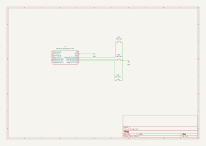
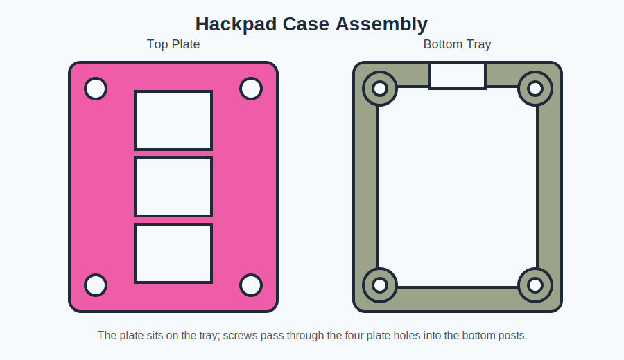

# 3-Key Hackpad

3-key macropad designed for Hack Club Hackpad / Stardance submission.

## Description

This is a compact 3-key macropad using a through-hole Seeed Studio XIAO RP2040 and MX-style switches. The case is a simple sandwich-style design with a bottom tray and top switch plate.

## Images

### Schematic

### PCB

### Case Assembly

## BOM

| Part | Quantity | Notes |
| --- | ---: | --- |
| Seeed Studio XIAO RP2040 | 1 | Through-hole mounted |
| MX-style switch | 3 | One per key |
| 1U keycap | 3 | Standard keycaps |
| 3D printed bottom case | 1 | `production/bottom_case.stl` |
| 3D printed top plate | 1 | `production/top_plate.stl` |
| Small screws | 4 | For mounting top plate to case posts |

## Firmware

The firmware in `Firmware/main.py` uses KMK and maps the three direct-to-ground switches to media keys.

## Folders

- `CAD/`: case source/export files
- `PCB/`: KiCad source files
- `Firmware/`: firmware source files
- `production/`: files used for manufacturing

## Final Checklist

- [x] Save the final routed PCB in KiCad so `PCB/hackpad.kicad_pcb` is not empty.
- [x] Export KiCad Gerbers as `production/gerbers.zip`.
- [x] Add firmware files to `Firmware/`.
- [x] Add screenshots above to this README.
- [ ] Upload all folders to GitHub.
- [ ] Make the Hackpad ship post.
- [ ] Fill out the Hackpad submission form.
